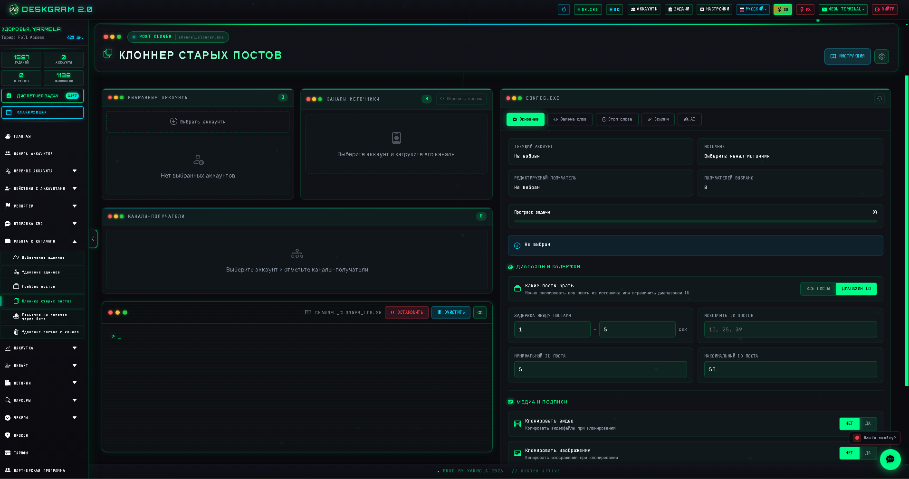
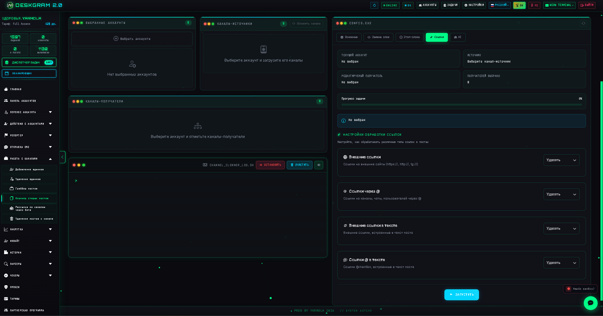
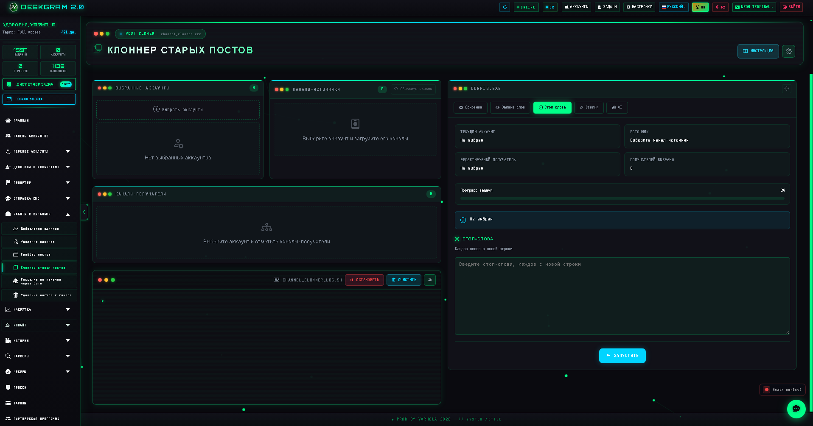
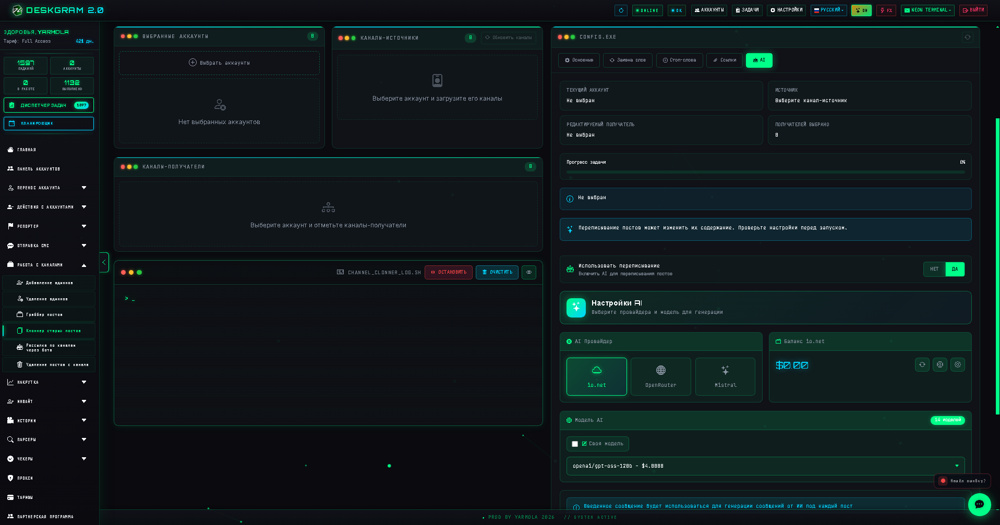

# Клоннер старых постов Telegram-каналов в Deskgram 2

Клоннер старых постов в Deskgram 2 помогает переносить и адаптировать уже опубликованный контент между Telegram-каналами без ручной пересборки каждого поста. Этот модуль полезен, когда нужно не просто копировать публикации, а управлять связками источник -> получатель, заменами, фильтрами и AI-обработкой текста.

[Главный хаб Deskgram 2](https://github.com/Deskgram-2/deskgram-2-telegram-automation) · [Сайт](https://deskgram2.com/) · [Telegram-бот](https://t.me/DG2welcomebot) · [Web preview](https://deskgram2.com/web-preview?path=%2Fapp-demo%2F&lang=ru)

## Интерактивный Web Preview

Попробовать модуль в браузере: [Открыть веб-превью](https://deskgram2.com/web-preview?path=%2Fapp-demo%2Ffunctions%2Fchannel_clonner&lang=ru)

Так можно заранее посмотреть логику связок источник -> получатель, табы замен и AI-блок еще до запуска рабочего сценария.

## Скриншоты

## Кратко о модуле

| Параметр | Что внутри |
|---|---|
| Основная задача | Клонирование старых Telegram-постов между каналами |
| Важные блоки | Источники, получатели, соответствия, замены, стоп-слова, ссылки, AI |
| Полезен для | Контентных сеток, перезапуска старых публикаций, адаптации архива |
| Связанные модули | Граббер постов, постинг по каналам, создание каналов, диспетчер задач |

## Что умеет модуль

- выбирать аккаунты, источники и каналы-получатели;
- собирать несколько соответствий источник -> получатель;
- настраивать замены слов, стоп-слова и ссылочные правила;
- применять AI-переписывание к клонируемым постам;
- вести лог выполнения и показывать прогресс по активным связкам.

## Быстрый старт

1. Выберите рабочие аккаунты и обновите список доступных каналов.
2. Задайте канал-источник и один или несколько каналов-получателей.
3. Создайте соответствия и настройте их отдельно.
4. При необходимости добавьте замены, стоп-слова, ссылки и AI-переписывание.
5. Запустите задачу и отслеживайте результат по логам.

## С чем особенно хорошо работает этот сценарий

- [Граббер постов Telegram-каналов](https://github.com/Deskgram-2/telegram-channel-post-grabber-deskgram), если нужен соседний сценарий с более гибкой пересборкой контента и медиаблоков;
- [Постинг по каналам](https://github.com/Deskgram-2/telegram-channel-posting-deskgram), если после адаптации контент нужно развести по подготовленной сетке площадок;
- [Создание каналов и групп](https://github.com/Deskgram-2/telegram-channel-creator-deskgram), если канальная инфраструктура еще только собирается;
- [Диспетчер задач](https://github.com/Deskgram-2/telegram-task-manager-deskgram), если контентный поток нужно держать внутри общего операционного контура.

## Как устроен сценарий

### Источник и получатели

Слева выбирается канал-источник, а ниже собирается список каналов-получателей. Это позволяет держать отдельные пары и не смешивать контентные маршруты между разными сетками.

### Соответствия

Каждая пара источник -> получатель хранится как отдельное соответствие. За счет этого можно по-разному обрабатывать контент для разных каналов, даже если исходный пост один и тот же.

### Редактура и AI

Вкладки замен, стоп-слов, ссылок и AI помогают не просто копировать архив, а адаптировать его под новую площадку, структуру ссылок и стиль подачи.

## Когда особенно полезен

- когда есть архив старых постов и его нужно оживить в другой канальной сетке;
- когда один и тот же источник должен по-разному переупаковываться под разные каналы;
- когда важно не копировать контент дословно, а слегка адаптировать его под новую воронку;
- когда контентный слой строится на сочетании архивных материалов и новой дистрибуции.

## Что выбрать: клоннер постов или граббер постов

| Если задача такая | Лучше использовать |
|---|---|
| Нужно переносить уже готовые старые посты между каналами по понятным соответствиям | [Клоннер старых постов](https://github.com/Deskgram-2/telegram-channel-post-cloner-deskgram) |
| Нужно глубже пересобирать контент, медиаблоки и текстовые добавки по парам каналов | [Граббер постов](https://github.com/Deskgram-2/telegram-channel-post-grabber-deskgram) |
| Нужен быстрый сценарий переиспользования архива | Клоннер постов |
| Нужен более гибкий маршрут для контентной переработки | Граббер постов |

## Что выбрать: клоннер постов или постинг по каналам

| Если задача такая | Лучше использовать |
|---|---|
| Есть архив существующих публикаций и нужно перенести его в другие каналы | [Клоннер старых постов](https://github.com/Deskgram-2/telegram-channel-post-cloner-deskgram) |
| Нужно разложить новый подготовленный пост по сетке каналов | [Постинг по каналам](https://github.com/Deskgram-2/telegram-channel-posting-deskgram) |
| Нужен путь "взять старое -> адаптировать -> разложить" | Клоннер + канал-постинг |
| Нет задачи работать со старым архивом | Канал-постинг |

## Смежные репозитории

- [Главный хаб Deskgram 2](https://github.com/Deskgram-2/deskgram-2-telegram-automation)
- [Граббер постов Telegram-каналов](https://github.com/Deskgram-2/telegram-channel-post-grabber-deskgram)
- [Постинг по каналам](https://github.com/Deskgram-2/telegram-channel-posting-deskgram)
- [Создание каналов и групп](https://github.com/Deskgram-2/telegram-channel-creator-deskgram)
- [Диспетчер задач](https://github.com/Deskgram-2/telegram-task-manager-deskgram)

## FAQ

### Можно ли сначала посмотреть модуль в браузере?

Да. Веб-превью помогает заранее открыть связки каналов, вкладки замен и AI-настройки до реального запуска задачи.

### Этот модуль копирует посты один в один?

Не обязательно. Его ценность как раз в том, что клонирование можно сочетать с заменами, фильтрами, ссылками и AI-переписыванием.

## FAQ для рабочих сценариев

### Когда клоннер постов особенно полезен для контентной сетки?

Когда у вас уже есть старый архив публикаций, который можно быстро переупаковать под другую сетку каналов без написания контента с нуля.

### Когда лучше сразу идти в канал-постинг, а не в клоннер?

Когда публикация уже подготовлена отдельно и ее не нужно брать из существующего канала-источника. В таком случае проще идти сразу в [постинг по каналам](https://github.com/Deskgram-2/telegram-channel-posting-deskgram).

### Что чаще всего дает лучший результат в этом модуле?

Обычно лучше всего работают чистые соответствия каналов, аккуратные замены под каждую площадку и умеренная AI-адаптация вместо простого слепого копирования.
